# 💰 Modelo de Mensalidades VisionVII - Sistema Escolar

## 📋 Visão Geral

Este sistema implementa um modelo de monetização baseado em **mensalidades dos professores**, onde o percentual de repasse das vendas depende do plano do professor.

---

## 🎯 Regras de Negócio

### Professores com Plano Pago (Subscription Ativa)

- ✅ **Recebem 100% das vendas dos seus cursos**
- ✅ Pagam mensalidade fixa ao sistema
- ✅ Acesso completo a recursos premium

### Professores no Plano Free

- ⚠️ **Recebem 70% das vendas dos seus cursos**
- ⚠️ Sistema fica com 30% de comissão
- ⚠️ Recursos limitados (max alunos, storage, etc.)

---

## 🔧 Implementação Técnica

### 1. Campo de Status da Subscription

**Model:** `TeacherFinancial`

```prisma
model TeacherFinancial {
  subscriptionStatus String @default("inactive") // "active" ou "inactive"
  plan               String @default("free")      // "free", "basic", "pro", "enterprise"
  // ... outros campos
}
```

**Status possíveis:**

- `active` - Professor com mensalidade paga e ativa
- `inactive` - Professor no plano free ou subscription expirada

---

### 2. Webhook Stripe - Payment Intent Succeeded

**Arquivo:** `/src/app/api/webhooks/stripe/route.ts`

**Função:** `handlePaymentIntentSucceeded()`

```typescript
// Busca status da subscription do professor
const teacher = await prisma.user.findUnique({
  where: { id: course.instructorId },
  select: {
    teacherFinancial: {
      select: {
        subscriptionStatus: true,
        stripeConnectAccountId: true,
        connectOnboardingComplete: true,
      },
    },
  },
});

// Calcula share baseado no plano
const hasPaidPlan = teacher.teacherFinancial.subscriptionStatus === 'active';
const sharePercent = hasPaidPlan ? 1.0 : 0.7; // 100% se pago, 70% se free

// Cria transfer via Stripe Connect
await stripe.transfers.create({
  amount: Math.floor(course.price * sharePercent * 100), // em centavos
  currency: 'brl',
  destination: teacher.teacherFinancial.stripeConnectAccountId,
  // ...
});
```

**Fluxo:**

1. Aluno compra curso
2. Pagamento aprovado → `payment_intent.succeeded`
3. Sistema verifica `subscriptionStatus` do professor
4. Transfer automático com percentual correto

---

### 3. Webhook Stripe - Subscription Updated/Cancelled

**Funções:** `handleSubscriptionUpdated()` e `handleSubscriptionCancelled()`

```typescript
// Atualiza status quando subscription é criada/renovada
await prisma.teacherFinancial.updateMany({
  where: { userId },
  data: {
    subscriptionStatus: status, // "active" ou "inactive"
    plan: plan,
    subscriptionStartDate: new Date(...),
    subscriptionExpiresAt: new Date(...),
  },
});
```

**Eventos:**

- `customer.subscription.updated` → Atualiza status para `active`
- `customer.subscription.deleted` → Atualiza status para `inactive`
- `customer.subscription.trial_will_end` → Notifica professor

---

### 4. API de Geração de Payouts

**Endpoint:** `POST /api/admin/payouts/generate`

**Arquivo:** `/src/app/api/admin/payouts/generate/route.ts`

**Lógica:**

```typescript
// Busca pagamentos com informação do plano do professor
const payments = await prisma.payment.findMany({
  where: { status: 'COMPLETED', ... },
  select: {
    amount: true,
    course: {
      select: {
        instructor: {
          select: {
            teacherFinancial: {
              select: { subscriptionStatus: true },
            },
          },
        },
      },
    },
  },
});

// Agrupa por professor e aplica percentual correto
for (const [teacherId, data] of totals.entries()) {
  const sharePercent = data.hasPaidPlan ? 1.0 : 0.7;
  const amount = data.total * sharePercent;
  // Cria registro de Payout
}
```

**Request:**

```json
{
  "periodStart": "2024-01-01T00:00:00Z",
  "periodEnd": "2024-01-31T23:59:59Z",
  "teacherId": "optional"
}
```

**Response:**

```json
{
  "data": [
    {
      "id": "payout_xxx",
      "teacherId": "teacher_123",
      "amount": 1000.0, // Já com percentual aplicado
      "periodStart": "2024-01-01T00:00:00Z",
      "periodEnd": "2024-01-31T23:59:59Z",
      "status": "pending"
    }
  ]
}
```

---

## 🔄 Fluxos Completos

### Fluxo 1: Professor com Plano Free vende curso


### Fluxo 2: Professor ativa mensalidade


### Fluxo 3: Professor com plano pago vende curso

```mermaid
sequenceDiagram
    Aluno->>Stripe: Compra curso (R$ 100)
    Stripe->>Webhook: payment_intent.succeeded
    Webhook->>DB: Verifica subscriptionStatus (active)
    Webhook->>Stripe Connect: Transfer R$ 100 (100%)
    Webhook->>DB: Cria Payout (R$ 100)
    Sistema->>Sistema: Não fica com nada, apenas recebe mensalidade
```



### Fluxo 4: Subscription expira


---

## 📊 Comparação de Planos

| Recurso                 | Plano Free | Plano Pago              |
| ----------------------- | ---------- | ----------------------- |
| **Repasse de Vendas**   | 70%        | 100%                    |
| **Comissão Sistema**    | 30%        | R$ 0 (paga mensalidade) |
| **Mensalidade**         | R$ 0       | R$ 49-199               |
| **Max Alunos**          | 10         | Ilimitado               |
| **Storage**             | 1 GB       | 50-200 GB               |
| **Upload Logo**         | ❌         | ✅                      |
| **Domínio Customizado** | ❌         | ✅                      |
| **Analytics Avançado**  | ❌         | ✅                      |

---

## 🧪 Testes

### Teste 1: Professor Free vende curso

```bash
# 1. Criar curso como professor free
curl -X POST http://localhost:3000/api/teacher/courses \
  -H "Cookie: session=..." \
  -d '{ "title": "Curso Teste", "price": 100 }'

# 2. Comprar curso como aluno
curl -X POST http://localhost:3000/api/checkout/session \
  -d '{ "courseId": "...", "provider": "stripe" }'

# 3. Verificar transfer (70% = R$ 70)
stripe transfers list --limit 1
```

### Teste 2: Professor ativa subscription

```bash
# 1. Criar subscription checkout
curl -X POST http://localhost:3000/api/teacher/subscriptions/create \
  -H "Cookie: session=..." \
  -d '{ "priceId": "price_xxx" }'

# 2. Verificar subscriptionStatus após pagamento
curl http://localhost:3000/api/teacher/profile
# Resposta: { "subscriptionStatus": "active" }
```

### Teste 3: Professor pago vende curso

```bash
# 1. Comprar curso de professor com subscription ativa
curl -X POST http://localhost:3000/api/checkout/session \
  -d '{ "courseId": "...", "provider": "stripe" }'

# 2. Verificar transfer (100% = R$ 100)
stripe transfers list --limit 1
```

---

## 🔒 Segurança

### Validação de Subscription Status

**CRÍTICO**: Sempre verificar `subscriptionStatus` e `subscriptionExpiresAt` antes de operações sensíveis:

```typescript
const teacher = await prisma.user.findUnique({
  where: { id },
  select: {
    teacherFinancial: {
      select: {
        subscriptionStatus: true,
        subscriptionExpiresAt: true,
      },
    },
  },
});

// Verificar se subscription está ativa E não expirada
const isActive =
  teacher.teacherFinancial.subscriptionStatus === 'active' &&
  teacher.teacherFinancial.subscriptionExpiresAt &&
  new Date() < teacher.teacherFinancial.subscriptionExpiresAt;

const sharePercent = isActive ? 1.0 : 0.7;
```

### Webhook Signature Verification

```typescript
// Sempre verificar assinatura do Stripe
const signature = request.headers.get('stripe-signature');
const event = stripe.webhooks.constructEvent(body, signature, webhookSecret);
```

---

## 📈 Métricas e Relatórios

### Query: Total de professores por plano

```typescript
const stats = await prisma.teacherFinancial.groupBy({
  by: ['subscriptionStatus'],
  _count: true,
});

// Resultado: { active: 45, inactive: 180 }
```

### Query: Revenue total do sistema (comissões)

```typescript
const payments = await prisma.payment.findMany({
  where: {
    status: 'COMPLETED',
    course: {
      instructor: {
        teacherFinancial: {
          subscriptionStatus: 'inactive', // Apenas free
        },
      },
    },
  },
  select: { amount: true },
});

const commission = payments.reduce((sum, p) => sum + p.amount * 0.3, 0);
```

### Query: Total de mensalidades recebidas

```typescript
const subscriptions = await prisma.teacherSubscription.findMany({
  where: { status: 'active' },
  select: { price: true },
});

const monthlyRevenue = subscriptions.reduce((sum, s) => sum + s.price, 0);
```

---

## 🚀 Próximos Passos

### Funcionalidades Opcionais

1. **Dashboard do Professor**

   - Página `/teacher/subscription` mostrando status
   - Botão "Upgrade para Plano Pago"
   - Histórico de repasses

2. **Admin Reports**

   - `/admin/reports/subscriptions` - Lista de professores e planos
   - `/admin/reports/revenue` - Breakdown de comissões vs mensalidades
   - Gráficos de conversão free → pago

3. **Cron Jobs**

   - Verificar subscriptions expirando em 7 dias
   - Enviar email notificando renovação
   - Auto-cancelar subscriptions vencidas (grace period)

4. **Feature Gating**
   - Bloquear features premium se `subscriptionStatus !== 'active'`
   - Exemplo: `/api/teacher/courses/[id]/analytics` → verificar plano

---

## 📞 Suporte

Para dúvidas sobre implementação:

- 📧 Email: dev@visionvii.com
- 📄 Docs: `/docs/subscription-model`
- 🔧 Código: `/src/app/api/webhooks/stripe/route.ts`

---

**Desenvolvido com excelência pela VisionVII** — Transformando educação através de tecnologia de ponta 🚀
