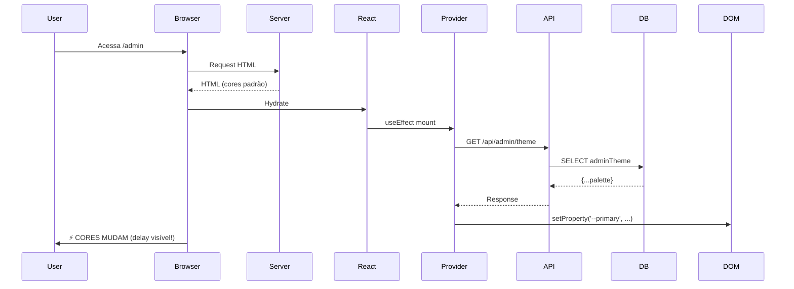

# 📊 AUDITORIA COMPLETA - SISTEMA DE TEMAS ATUAL

**Data**: 19 de dezembro de 2025  
**Status**: Estrutura fragmentada, delays de carregamento, implementação incompleta

---

## 🔍 1. ESTRUTURA ATUAL IDENTIFICADA

### 1.1 Providers Existentes (11 arquivos)

| Arquivo                      | Usuário | Status         | Problema                   |
| ---------------------------- | ------- | -------------- | -------------------------- |
| `admin-theme-provider.tsx`   | Admin   | ⚠️ Parcial     | Client-side, delay visível |
| `teacher-theme-provider.tsx` | Teacher | ⚠️ Parcial     | Client-side, delay visível |
| `student-theme-provider.tsx` | Student | ⚠️ Parcial     | Herda de teacher, complexo |
| `theme-sync-provider.tsx`    | Público | ❌ Quebrado    | publicTheme null no banco  |
| `public-theme-provider.tsx`  | Público | ❌ Duplicado   | Conflita com sync          |
| `public-theme-boundary.tsx`  | Público | ❌ Duplicado   | Boundary desnecessário     |
| `navbar-theme-provider.tsx`  | Global  | ❌ Confuso     | Propósito não claro        |
| `theme-provider.tsx`         | Global  | ✅ next-themes | Dark mode, mantido         |
| `theme-test-component.tsx`   | -       | 🗑️ Lixo        | Arquivo de teste           |

### 1.2 Modelos Prisma

```prisma
TeacherTheme {
  id, userId, palette (JSON), layout (JSON), animations (JSON), themeName
}

AdminTheme {
  id, adminId, palette (JSON), layout (JSON), animations (JSON), themeName
}

SystemConfig {
  publicTheme (JSON) - QUEBRADO (sempre null)
}
```

**Problema**:

- Student não tem tabela própria (herda de teacher - complexo!)
- JSON sem type-safety
- Relações confusas

### 1.3 API Routes

| Endpoint                   | Método         | Problema                       |
| -------------------------- | -------------- | ------------------------------ |
| `/api/teacher/theme`       | GET/PUT/DELETE | ✅ Funciona                    |
| `/api/admin/theme`         | GET/PUT/DELETE | ❌ prisma.adminTheme undefined |
| `/api/student/theme`       | -              | ❌ Não existe                  |
| `/api/system/public-theme` | GET            | ❌ Retorna sempre null         |

### 1.4 Aplicação de Temas (Como Funciona Hoje)

```typescript
// PROBLEMA 1: Client-side only
useEffect(() => {
  loadTheme(); // Busca API depois do mount
  applyThemeToDom(); // Aplica CSS variables
}, []);

// PROBLEMA 2: Flash de cores
// 1. Página carrega com cores padrão (branco)
// 2. React monta
// 3. useEffect dispara
// 4. Fetch API (delay de rede)
// 5. Aplica tema (usuário vê transição)

// PROBLEMA 3: Cada provider aplica do seu jeito
document.documentElement.style.setProperty('--primary', value, 'important');
```

---

## ⚠️ 2. PROBLEMAS IDENTIFICADOS

### 2.1 Performance e UX

❌ **Flash de cores não sincronizadas** (FOUC - Flash of Unstyled Content)  
❌ **Delay visível de 200-500ms** ao carregar tema  
❌ **Múltiplos fetches** para mesma informação  
❌ **Cada página recarrega** tema do zero  
❌ **localStorage inconsistente** (5min cache, pode estar stale)

### 2.2 Arquitetura

❌ **9 providers diferentes** fazendo coisas similares  
❌ **3 formas de aplicar CSS variables**  
❌ **Lógica espalhada** em 11 arquivos  
❌ **Student herda de Teacher** (complexo e frágil)  
❌ **Sem type-safety** (JSON no banco)

### 2.3 Banco de Dados

❌ **AdminTheme não funciona** (Prisma Client não gerado)  
❌ **publicTheme sempre null** (sem seed)  
❌ **Student sem tabela própria**  
❌ **JSON fields** sem validação

### 2.4 Manutenibilidade

❌ **Código duplicado** em 11 arquivos  
❌ **Logs poluídos** com `[AdminTheme]`, `[TeacherTheme]`  
❌ **Documentação fragmentada** (8+ arquivos MD)  
❌ **Testes inexistentes**

---

## 🎨 3. COMO CORES SÃO APLICADAS HOJE

### 3.1 Fluxo Atual (Problemático)



### 3.2 CSS Variables Usadas

```css
:root {
  --background: 0 0% 100%;
  --foreground: 240 10% 3.9%;
  --primary: 221.2 83.2% 53.3%;
  --primary-foreground: 210 40% 98%;
  --secondary: 210 40% 96.1%;
  --secondary-foreground: 222.2 47.4% 11.2%;
  --accent: 210 40% 96.1%;
  --accent-foreground: 222.2 47.4% 11.2%;
  --card: 0 0% 100%;
  --card-foreground: 240 10% 3.9%;
  --muted: 210 40% 96.1%;
  --muted-foreground: 215.4 16.3% 46.9%;
}

/* Tailwind usa assim: */
.bg-primary {
  background-color: hsl(var(--primary));
}
```

---

## 📚 4. BIBLIOTECAS ATUAIS

| Biblioteca         | Uso             | Avalição                      |
| ------------------ | --------------- | ----------------------------- |
| **next-themes**    | Dark/Light mode | ✅ MANTER (padrão de mercado) |
| **Tailwind CSS**   | Utility classes | ✅ MANTER (core do design)    |
| **Shadcn/UI**      | Componentes     | ✅ MANTER (usa CSS variables) |
| **Zustand**        | State global    | ❌ NÃO USADO para temas       |
| **TanStack Query** | Cache API       | ❌ NÃO USADO para temas       |

---

## ✅ 5. RECOMENDAÇÕES

### 5.1 Stack Otimizada

```typescript
// ✅ USAR
- Next.js Middleware (detecção de role)
- Cookies HTTP-only (tema persistente)
- Server Components (SSR, zero delay)
- CSS Variables (Tailwind-native)
- Prisma com tipos TypeScript (type-safety)
- next-themes (dark mode apenas)

// ❌ REMOVER
- 9 providers client-side
- localStorage (não SSR-friendly)
- Múltiplos fetches API
- JSON no banco sem tipos
```

### 5.2 Arquitetura Proposta

```
/lib/themes
  ├── presets.ts              # 6 temas escolares profissionais
  ├── config.ts               # Configuração card styles
  └── apply-theme.server.ts   # Função SSR para aplicar tema

/app/api/themes
  ├── [role]/route.ts         # GET/PUT/DELETE por role
  └── sync/route.ts           # Sincronização multi-tab

middleware.ts                 # Detecta role + carrega tema no cookie

/components
  └── theme-script.tsx        # <script> inline no HTML (zero delay)

Prisma:
- UserTheme (userId + role + presetId + cardConfig)
```

### 5.3 Fonte E-Learning Recomendada

```css
/* Opções profissionais para e-learning: */

/* OPÇÃO 1: Inter (moderna, clean, ótima legibilidade) */
font-family: 'Inter', system-ui, sans-serif;

/* OPÇÃO 2: Poppins (friendly, escolar) */
font-family: 'Poppins', system-ui, sans-serif;

/* OPÇÃO 3: System UI (nativa, performance) */
font-family: system-ui, -apple-system, 'Segoe UI', sans-serif;

/* RECOMENDAÇÃO: Inter (melhor custo-benefício) */
```

---

## 🎨 6. TEMAS ESCOLARES PROFISSIONAIS (Proposta)

| ID  | Nome              | Cores Primárias       | Psicologia              | Uso                |
| --- | ----------------- | --------------------- | ----------------------- | ------------------ |
| 1   | **Academic Blue** | `#2563EB` / `#1E40AF` | Confiança, conhecimento | Dashboard padrão   |
| 2   | **Forest Green**  | `#059669` / `#047857` | Crescimento, natureza   | STEM, ciências     |
| 3   | **Sunset Orange** | `#EA580C` / `#C2410C` | Energia, criatividade   | Artes, humanidades |
| 4   | **Royal Purple**  | `#7C3AED` / `#6D28D9` | Sabedoria, luxo         | Premium courses    |
| 5   | **Ocean Teal**    | `#0891B2` / `#0E7490` | Calma, foco             | Leitura intensiva  |
| 6   | **Crimson Red**   | `#DC2626` / `#B91C1C` | Ação, urgência          | Deadlines, avisos  |

Cada tema terá:

- 2 tons de primary (normal + hover)
- Secondary complementar
- Accent contrastante
- Backgrounds neutros
- Cards configuráveis (flat/elevated/bordered/glass)

---

## 📝 7. PLANO DE AÇÃO

### FASE 1: Limpeza (1-2h)

- [ ] Deletar 9 providers desnecessários
- [ ] Remover todas CSS variables customizadas
- [ ] Resetar para preto/branco
- [ ] Limpar tabelas TeacherTheme, AdminTheme

### FASE 2: Fundação (2-3h)

- [ ] Criar UserTheme table unificada
- [ ] Implementar 6 temas profissionais
- [ ] Adicionar fonte Inter
- [ ] CSS reset completo

### FASE 3: SSR Theme (3-4h)

- [ ] Middleware com cookie
- [ ] Server-side theme detection
- [ ] Inline script (zero delay)
- [ ] API routes otimizadas

### FASE 4: Cards Avançados (2h)

- [ ] 4 estilos: flat/elevated/bordered/glass
- [ ] Configurações 3D
- [ ] Animações smooth

### FASE 5: Testes (1h)

- [ ] Zero delay visual
- [ ] Sincronização multi-tab
- [ ] Performance Lighthouse

**TOTAL ESTIMADO**: 9-12 horas

---

## 🚀 PRÓXIMO PASSO

**INICIAR LIMPEZA COMPLETA**:

1. Backup do projeto
2. Deletar providers
3. Limpar globals.css
4. Reset banco de dados

**Aguardando aprovação para começar a demolição.**

---

**Desenvolvido com excelência pela VisionVII** 🚀
